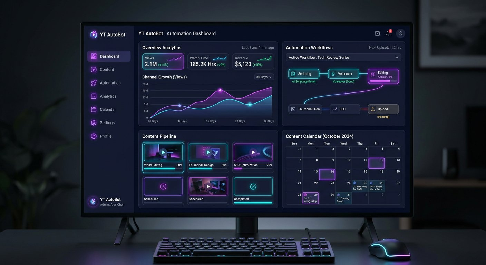

# TubeFlow - YouTube Automation Dashboard

A professional, high-performance dashboard designed for YouTube content creators and automation teams. TubeFlow helps manage the entire content lifecycle from brainstorming to cross-platform distribution.



## 🚀 Key Features

- **📊 Centralized Dashboard**: Real-time channel performance metrics including subscriber growth, revenue, and watch hours.
- **🎬 Content Pipeline**: Multi-view management system (List & Kanban Board) for tracking videos through stages like Scripting, Editing, and Thumbnail design.
- **📅 Smart Scheduler**: Integrated calendar to plan and visualize content distribution across YouTube, TikTok, and Shorts.
- **📈 Advanced Analytics**: Interactive data visualization for views, traffic sources, and revenue breakdown powered by Recharts.
- **⚡ Automation Suite**: Rule-based workflow engine to automate tasks like cross-posting, Shorts extraction, and community engagement.
- **💡 Ideas Bank**: Prioritized brainstorming repository to capture and evaluate content concepts before they enter production.

## 🛠️ Tech Stack

- **Framework**: [React 19](https://react.dev/)
- **Build Tool**: [Vite](https://vitejs.dev/)
- **Styling**: [Tailwind CSS 4.0](https://tailwindcss.com/)
- **Icons**: [Lucide React](https://lucide.dev/)
- **Charts**: [Recharts](https://recharts.org/)
- **State Management**: React Hooks (useState, useMemo)
- **Type Safety**: [TypeScript](https://www.typescriptlang.org/)

## 📂 Project Structure

```text
src/
├── components/          # Modular UI components (Tabs, Cards, Sidebar)
├── data/               # Mock data for demonstration
├── utils/              # Helper functions (cn utility for Tailwind)
├── types.ts            # Global TypeScript interfaces
├── App.tsx             # Main application entry and routing
├── index.css           # Global styles and Tailwind configuration
└── main.tsx            # React DOM entry point
```

## 🎨 Theme & UI

The application uses a custom "YouTube Dark" inspired theme with:
- **Primary Accents**: `#7c3aed` (Violet) and `#06b6d4` (Cyan)
- **Backgrounds**: Deep navy and charcoal surfaces (`#0f0f0f`, `#1e1e30`)
- **Animations**: Custom fade-in and slide-in transitions for a smooth SPA feel.

## 🏁 Getting Started

### Prerequisites
- Node.js (Latest LTS recommended)
- npm or yarn

### Installation
```bash
npm install
```

### Development
```bash
npm run dev
```

### Build
```bash
npm run build
```

---
Built with ❤️ for YouTube Content Creators.
